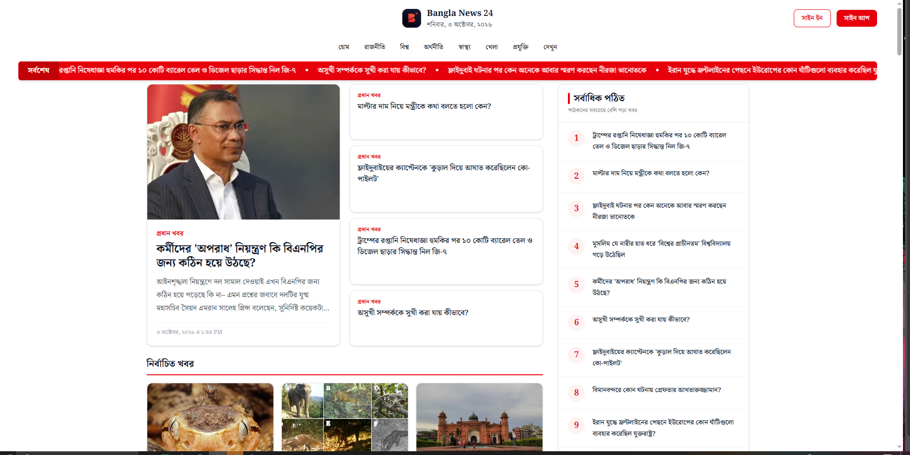

# 📰 Bangla News 24

Bangla News 24 is a modern and responsive Bangla news website where users can explore the latest news, browse news by category, read detailed articles, and discover the most-read stories.

The project focuses on a clean news-reading experience, responsive design, smooth navigation, API-based data fetching, loading states, and proper error handling.

---

## 📸 Screenshot



---

## ✨ Features

### 📰 Latest News

- Browse the latest Bangla news
- View featured news on the homepage
- Explore multiple news sections
- Read news summaries and publication dates
- Navigate directly to detailed articles

### 📂 News Categories

Users can browse news by category.

Each category page displays:

- Category title
- News cards
- News images
- News descriptions
- Publication dates
- Links to full articles

### 📖 News Details

Users can open any news article and view:

- Full article title
- Category
- Publication date
- Author/byline
- Article images
- Image captions
- Article text
- Tags
- Word count
- News source

### 🔥 Most Read News

The homepage includes a **Most Read** section where users can discover popular articles.

Each item includes:

- Ranking number
- News title
- Direct link to the article

### 📢 Latest News Marquee

A scrolling latest-news marquee displays recent headlines.

Users can click any headline to open the corresponding article.

### ⏳ Loading Skeleton

The application includes a responsive loading skeleton while news data is being loaded.

Skeleton layouts are used for:

- Featured news
- Secondary news
- News cards
- Most-read news

### ❌ Custom 404 Page

A custom styled 404 page is included for unavailable pages.

The page provides:

- 404 status
- Clear Bangla error message
- Explanation for the missing page
- Back to Home button
- Responsive design

### ⚠️ Error Handling

The application includes a dedicated error page for unexpected errors.

Users are provided with:

- Friendly error message
- Clear explanation
- Try Again button

### 📰 Article Not Found Handling

If an article does not exist or the API returns an unsuccessful response, the application uses Next.js `notFound()` handling to display the custom 404 page.

### 📱 Responsive Design

The application is designed to work across:

- Mobile devices
- Tablets
- Laptops
- Desktop screens

The layout automatically adapts between different screen sizes.

---

## 🛠️ Tech Stack

### Frontend

- Next.js
- React
- TypeScript

### Styling

- Tailwind CSS
- DaisyUI

### Additional Libraries

- React Fast Marquee

### Data

- REST API
- Server-side data fetching
- TypeScript interfaces for API responses

---

## 📦 Dependencies

The project uses the following main dependencies:

- Next.js
- React
- React DOM
- React Fast Marquee
- Tailwind CSS
- DaisyUI

All project dependencies and development dependencies are defined in `package.json`.

---

## 🚀 Getting Started

Follow these steps to run the project locally.

### 1. Clone the repository

```bash
git clone https://github.com/Emransani01/Bangla-News-24.git
